# 📊 Diagrama de Flujo - Triggers Fase 2
## Sistema ArteCryptoAuctions

---

## 🎯 Visión General del Proceso

El sistema de triggers implementa un flujo automatizado completo desde la creación de un NFT hasta las ofertas en subastas, pasando por validaciones técnicas, curación administrativa y creación automática de subastas.

### Flujo Principal:
```
NFT Creado → Validaciones → Asignación Curador → Decisión Curador → Subasta Automática → Ofertas
```

---

## 🔄 Diagrama de Flujo Completo

```mermaid
flowchart TD
    Start([Artista crea NFT]) --> T1_Start[TRIGGER 1: tr_NFT_InsertFlow]
    
    T1_Start --> V1{¿Usuario tiene<br/>rol ARTIST?}
    V1 -->|NO| E1[❌ Email: Rol Inválido]
    E1 --> End1([FIN - NFT Rechazado])
    
    V1 -->|SÍ| V2{¿Tiene email<br/>primario?}
    V2 -->|NO| E2[❌ Email: Email Requerido]
    E2 --> End1
    
    V2 -->|SÍ| V3{¿Validaciones<br/>técnicas OK?}
    V3 -->|NO| E3[❌ Email: Validación Técnica]
    E3 --> End1
    
    V3 -->|SÍ| V4{¿Existen<br/>curadores?}
    V4 -->|NO| E4[⚠️ Email: Sin Curadores]
    E4 --> End1
    
    V4 -->|SÍ| A1[✅ Insertar NFT en nft.NFT]
    A1 --> A2[🔐 Generar HashCode SHA2_256]
    A2 --> A3[📝 Estado: PENDING]
    A3 --> A4[🎲 Asignar Curador Round-Robin]
    A4 --> A5[📋 Crear CurationReview]
    A5 --> A6[📧 Email a Artista: Aceptado]
    A6 --> A7[📧 Email a Curador: Nuevo NFT]
    A7 --> A8[🔄 Actualizar posición RR]
    A8 --> Wait1([⏳ Espera Decisión Curador])
    
    Wait1 --> T2_Start[TRIGGER 2: tr_CurationReview_Decision]
    
    T2_Start --> D1{¿DecisionCode<br/>cambió?}
    D1 -->|NO| End2([FIN - Sin cambios])
    
    D1 -->|SÍ| D2{¿De PENDING a<br/>APPROVED/REJECTED?}
    D2 -->|NO| End2
    
    D2 -->|SÍ| D3{Decisión}
    
    D3 -->|REJECTED| R1[❌ Actualizar NFT: REJECTED]
    R1 --> R2[📧 Email a Artista: No Aprobado]
    R2 --> R3[📧 Email a Curador: Decisión Procesada]
    R3 --> End3([FIN - NFT Rechazado])
    
    D3 -->|APPROVED| AP1[✅ Actualizar NFT: APPROVED]
    AP1 --> AP2[📅 Registrar ApprovedAtUtc]
    AP2 --> AP3[📧 Email a Artista: Aprobado]
    AP3 --> AP4[📧 Email a Curador: Decisión Procesada]
    AP4 --> Wait2([⏳ Trigger Automático])
    
    Wait2 --> T3_Start[TRIGGER 3: tr_NFT_CreateAuction]
    
    T3_Start --> AU1{¿StatusCode<br/>cambió a APPROVED?}
    AU1 -->|NO| End4([FIN - Sin cambios])
    
    AU1 -->|SÍ| AU2[📋 Obtener AuctionSettings]
    AU2 --> AU3[💰 Determinar precio inicial]
    AU3 --> AU4[⏰ Calcular fechas inicio/fin]
    AU4 --> AU5[✅ Crear Auction: ACTIVE]
    AU5 --> AU6[📧 Email a Artista: Subasta Iniciada]
    AU6 --> AU7[📧 Email a BIDDERS: Nueva Subasta]
    AU7 --> Wait3([⏳ Espera Ofertas])
    
    Wait3 --> T4_Start[TRIGGER 4: tr_Bid_Validation]
    
    T4_Start --> B1{¿Subasta<br/>existe?}
    B1 -->|NO| BE1[❌ Email: Subasta no existe]
    BE1 --> End5([FIN - Oferta Rechazada])
    
    B1 -->|SÍ| B2{¿Subasta<br/>ACTIVE?}
    B2 -->|NO| BE2[❌ Email: Subasta no activa]
    BE2 --> End5
    
    B2 -->|SÍ| B3{¿Dentro del<br/>período?}
    B3 -->|NO| BE3[❌ Email: Fuera de tiempo]
    BE3 --> End5
    
    B3 -->|SÍ| B4{¿Oferta ><br/>precio actual?}
    B4 -->|NO| BE4[❌ Email: Oferta muy baja]
    BE4 --> End5
    
    B4 -->|SÍ| B5{¿Oferente ≠<br/>Artista?}
    B5 -->|NO| BE5[❌ Email: Artista no puede ofertar]
    BE5 --> End5
    
    B5 -->|SÍ| BI1[✅ Insertar Bid]
    BI1 --> BI2[💰 Actualizar CurrentPriceETH]
    BI2 --> BI3[👤 Actualizar CurrentLeaderId]
    BI3 --> BI4[📧 Email a Nuevo Líder: Oferta Aceptada]
    BI4 --> BI5[📧 Email a Líder Anterior: Superado]
    BI5 --> BI6[📧 Email a Artista: Nueva Oferta]
    BI6 --> End6([✅ Oferta Procesada])
    
    style T1_Start fill:#e1f5ff,stroke:#0066cc,stroke-width:3px
    style T2_Start fill:#fff4e1,stroke:#ff9900,stroke-width:3px
    style T3_Start fill:#e8f5e9,stroke:#4caf50,stroke-width:3px
    style T4_Start fill:#f3e5f5,stroke:#9c27b0,stroke-width:3px
    
    style E1 fill:#ffebee,stroke:#f44336
    style E2 fill:#ffebee,stroke:#f44336
    style E3 fill:#ffebee,stroke:#f44336
    style E4 fill:#fff3e0,stroke:#ff9800
    
    style BE1 fill:#ffebee,stroke:#f44336
    style BE2 fill:#ffebee,stroke:#f44336
    style BE3 fill:#ffebee,stroke:#f44336
    style BE4 fill:#ffebee,stroke:#f44336
    style BE5 fill:#ffebee,stroke:#f44336
    
    style R1 fill:#ffebee,stroke:#f44336
    style AP1 fill:#e8f5e9,stroke:#4caf50
    style AU5 fill:#e8f5e9,stroke:#4caf50
    style BI1 fill:#e8f5e9,stroke:#4caf50
```



---

## 📋 Detalle de Cada Trigger

### 🔵 TRIGGER 1: tr_NFT_InsertFlow
**Tabla:** `nft.NFT`  
**Tipo:** INSTEAD OF INSERT  
**Propósito:** Validar y procesar la inserción de nuevos NFTs

#### Validaciones Realizadas:
1. ✅ **Validación de Rol**
   - Usuario debe tener RoleId = 2 (ARTIST)
   - Consulta: `core.UserRole`

2. ✅ **Validación de Email**
   - Usuario debe tener email primario
   - Consulta: `core.UserEmail WHERE IsPrimary = 1`

3. ✅ **Validaciones Técnicas** (contra `nft.NFTSettings`)
   - WidthPx: entre MinWidthPx y MaxWidthPx
   - HeightPx: entre MinHeightPx y MaxHeightPx
   - FileSizeBytes: entre MinFileSizeBytes y MaxFileSizeBytes

4. ✅ **Validación de Curadores**
   - Debe existir al menos un curador (RoleId = 3)

#### Acciones Realizadas:
```sql
-- 1. Insertar NFT
INSERT INTO nft.NFT (
    ArtistId, SettingsID, [Name], [Description],
    ContentType, HashCode, FileSizeBytes, WidthPx, HeightPx,
    SuggestedPriceETH, StatusCode = 'PENDING', CreatedAtUtc
)

-- 2. Generar HashCode único
HashCode = LEFT(CONVERT(VARCHAR(64), 
    HASHBYTES('SHA2_256', 
        NEWID() + ArtistId + SYSUTCDATETIME() + CRYPT_GEN_RANDOM(16)
    ), 2), 64)

-- 3. Asignar curador (Round-Robin)
-- Usa ops.Settings con clave 'CURATION_RR_POS'
CuradorIdx = (CurrentPos + RowNum - 1) % TotalCuradores + 1

-- 4. Crear registro de curación
INSERT INTO admin.CurationReview (
    NFTId, CuratorId, DecisionCode = 'PENDING', StartedAtUtc
)

-- 5. Actualizar posición Round-Robin
UPDATE ops.Settings 
SET SettingValue = (CurrentPos + NFTCount) % TotalCuradores
WHERE SettingKey = 'CURATION_RR_POS'
```

#### Notificaciones Email:
| Destinatario | Asunto | Condición |
|--------------|--------|-----------|
| Artista | "NFT Rechazado - Rol Inválido" | Sin rol ARTIST |
| Artista | "NFT Rechazado - Email Requerido" | Sin email primario |
| Artista | "NFT Rechazado - Validación Técnica" | Falla validación técnica |
| Artista | "NFT en Espera - Sin Curadores" | No hay curadores |
| Artista | "NFT Aceptado - En Revisión" | ✅ NFT insertado |
| Curador | "Nuevo NFT para Revisión" | ✅ NFT asignado |

---

### 🟡 TRIGGER 2: tr_CurationReview_Decision
**Tabla:** `admin.CurationReview`  
**Tipo:** AFTER UPDATE  
**Propósito:** Procesar decisiones de curadores

#### Condición de Activación:
```sql
-- Solo si DecisionCode cambió de PENDING a APPROVED/REJECTED
WHERE i.DecisionCode IN ('APPROVED', 'REJECTED')
  AND d.DecisionCode = 'PENDING'
  AND i.DecisionCode <> d.DecisionCode
```

#### Flujo APPROVED:
```sql
-- 1. Actualizar NFT
UPDATE nft.NFT
SET StatusCode = 'APPROVED',
    ApprovedAtUtc = SYSUTCDATETIME()
WHERE NFTId IN (SELECT NFTId FROM @Decisions WHERE DecisionCode = 'APPROVED')

-- 2. Esto dispara automáticamente el TRIGGER 3
```

#### Flujo REJECTED:
```sql
-- 1. Actualizar NFT
UPDATE nft.NFT
SET StatusCode = 'REJECTED'
WHERE NFTId IN (SELECT NFTId FROM @Decisions WHERE DecisionCode = 'REJECTED')

-- 2. FIN del proceso (no se crea subasta)
```

#### Notificaciones Email:
| Destinatario | Asunto | Condición |
|--------------|--------|-----------|
| Artista | "¡NFT Aprobado!" | DecisionCode = APPROVED |
| Artista | "NFT No Aprobado" | DecisionCode = REJECTED |
| Curador | "Decisión Procesada" | Siempre |

---

### 🟢 TRIGGER 3: tr_NFT_CreateAuction
**Tabla:** `nft.NFT`  
**Tipo:** AFTER UPDATE  
**Propósito:** Crear subasta automáticamente cuando NFT es aprobado

#### Condición de Activación:
```sql
-- Solo si StatusCode cambió a APPROVED
WHERE i.StatusCode = 'APPROVED'
  AND d.StatusCode <> 'APPROVED'
  AND i.ApprovedAtUtc IS NOT NULL
```

#### Configuración de Subasta:
```sql
-- Obtener configuración
SELECT TOP 1
    @SettingsID = SettingsID,
    @BasePriceETH = BasePriceETH,
    @DefaultAuctionHours = DefaultAuctionHours
FROM auction.AuctionSettings

-- Valores por defecto si no existe configuración
@BasePriceETH = 0.01
@DefaultAuctionHours = 72
```

#### Creación de Subasta:
```sql
INSERT INTO auction.Auction (
    SettingsID,
    NFTId,
    StartAtUtc = SYSUTCDATETIME(),  -- Inicia inmediatamente
    EndAtUtc = DATEADD(HOUR, @DefaultAuctionHours, SYSUTCDATETIME()),
    StartingPriceETH = COALESCE(SuggestedPriceETH, @BasePriceETH),
    CurrentPriceETH = COALESCE(SuggestedPriceETH, @BasePriceETH),
    StatusCode = 'ACTIVE'
)
```

#### Notificaciones Email:
| Destinatario | Asunto | Información Incluida |
|--------------|--------|---------------------|
| Artista | "¡Subasta Iniciada!" | AuctionId, Precio Inicial, Fechas |
| Todos los BIDDERS | "Nueva Subasta Disponible" | NFT Name, Precio Inicial, Fecha Fin |

---

### 🟣 TRIGGER 4: tr_Bid_Validation
**Tabla:** `auction.Bid`  
**Tipo:** INSTEAD OF INSERT  
**Propósito:** Validar y procesar ofertas en subastas

#### Validaciones Realizadas:
```sql
-- 1. Subasta existe
WHERE a.AuctionId IS NULL

-- 2. Subasta está activa
WHERE a.StatusCode <> 'ACTIVE'

-- 3. Dentro del período
WHERE SYSUTCDATETIME() < a.StartAtUtc  -- No ha comenzado
   OR SYSUTCDATETIME() > a.EndAtUtc    -- Ya finalizó

-- 4. Oferta mayor al precio actual
WHERE ib.AmountETH <= a.CurrentPriceETH

-- 5. Oferente no es el artista
WHERE ib.BidderId = nft.ArtistId
```

#### Procesamiento de Oferta Válida:
```sql
-- 1. Insertar oferta
INSERT INTO auction.Bid (AuctionId, BidderId, AmountETH, PlacedAtUtc)

-- 2. Actualizar subasta
UPDATE auction.Auction
SET CurrentPriceETH = @NewAmount,
    CurrentLeaderId = @NewBidderId
WHERE AuctionId = @AuctionId
```

#### Notificaciones Email:
| Destinatario | Asunto | Condición |
|--------------|--------|-----------|
| Oferente | "Oferta Rechazada" | Validación falla |
| Nuevo Líder | "¡Oferta Aceptada!" | ✅ Oferta válida |
| Líder Anterior | "Ha sido superado en la subasta" | Si existe líder anterior |
| Artista | "Nueva oferta en su NFT" | ✅ Oferta válida |

---

## 📊 Tablas Involucradas por Trigger

### TRIGGER 1 (tr_NFT_InsertFlow):
- 📝 **INSERT:** `nft.NFT`, `admin.CurationReview`, `audit.EmailOutbox`
- 🔍 **SELECT:** `core.UserRole`, `core.UserEmail`, `nft.NFTSettings`, `ops.Status`, `ops.Settings`
- ✏️ **UPDATE:** `ops.Settings` (Round-Robin position)

### TRIGGER 2 (tr_CurationReview_Decision):
- 📝 **INSERT:** `audit.EmailOutbox`, `ops.Status` (si no existe)
- 🔍 **SELECT:** `nft.NFT`, `core.UserEmail`
- ✏️ **UPDATE:** `nft.NFT` (StatusCode, ApprovedAtUtc), `admin.CurationReview` (ReviewedAtUtc)

### TRIGGER 3 (tr_NFT_CreateAuction):
- 📝 **INSERT:** `auction.Auction`, `audit.EmailOutbox`, `ops.Status` (si no existe)
- 🔍 **SELECT:** `nft.NFT`, `core.UserEmail`, `auction.AuctionSettings`, `core.UserRole`

### TRIGGER 4 (tr_Bid_Validation):
- 📝 **INSERT:** `auction.Bid`, `audit.EmailOutbox`
- 🔍 **SELECT:** `auction.Auction`, `nft.NFT`, `core.UserEmail`
- ✏️ **UPDATE:** `auction.Auction` (CurrentPriceETH, CurrentLeaderId)

---

## 🔐 Estados del Sistema

### Estados de NFT (`nft.NFT.StatusCode`):
```
PENDING → APPROVED → (Subasta creada)
   ↓
REJECTED (FIN)
```

### Estados de Curación (`admin.CurationReview.DecisionCode`):
```
PENDING → APPROVED / REJECTED
```

### Estados de Subasta (`auction.Auction.StatusCode`):
```
ACTIVE → (Proceso de finalización - Fase 3)
```

### Estados de Email (`audit.EmailOutbox.StatusCode`):
```
PENDING → SENT / FAILED
```

---

## ⚙️ Configuraciones del Sistema

### ops.Settings:
| SettingKey | Propósito | Usado en |
|------------|-----------|----------|
| `CURATION_RR_POS` | Posición actual del Round-Robin | TRIGGER 1 |

### ops.Status:
| Domain | Code | Descripción |
|--------|------|-------------|
| NFT | PENDING | NFT pendiente de aprobación |
| NFT | APPROVED | NFT aprobado y listo para subasta |
| NFT | REJECTED | NFT rechazado por curador |
| CURATION_DECISION | PENDING | Pendiente de revisión por curador |
| AUCTION | ACTIVE | Subasta activa |

---

## 🎯 Casos de Uso Completos

### Caso 1: NFT Exitoso (Flujo Completo)
```
1. Artista crea NFT → TRIGGER 1
   ✅ Validaciones pasan
   ✅ NFT insertado con StatusCode = 'PENDING'
   ✅ Curador asignado (Round-Robin)
   ✅ CurationReview creado
   📧 Emails enviados

2. Curador aprueba → TRIGGER 2
   ✅ DecisionCode = 'APPROVED'
   ✅ NFT.StatusCode = 'APPROVED'
   📧 Emails enviados

3. Sistema crea subasta → TRIGGER 3
   ✅ Auction creado con StatusCode = 'ACTIVE'
   ✅ Precio inicial configurado
   ✅ Fechas calculadas (72 horas)
   📧 Emails a artista y bidders

4. Usuarios ofertan → TRIGGER 4
   ✅ Validaciones de oferta
   ✅ Bid insertado
   ✅ Auction actualizado (precio y líder)
   📧 Emails a participantes
```

### Caso 2: NFT Rechazado
```
1. Artista crea NFT → TRIGGER 1
   ✅ Validaciones pasan
   ✅ NFT insertado con StatusCode = 'PENDING'

2. Curador rechaza → TRIGGER 2
   ❌ DecisionCode = 'REJECTED'
   ❌ NFT.StatusCode = 'REJECTED'
   📧 Email de rechazo
   🛑 FIN (no se crea subasta)
```

### Caso 3: Validación Técnica Falla
```
1. Artista crea NFT → TRIGGER 1
   ❌ Validación técnica falla (ej: archivo muy grande)
   📧 Email con error específico
   🛑 NFT no insertado
```

### Caso 4: Oferta Inválida
```
1. Usuario intenta ofertar → TRIGGER 4
   ❌ Validación falla (ej: oferta muy baja)
   📧 Email con razón del rechazo
   🛑 Bid no insertado
```

---

## 🔄 Algoritmo Round-Robin (Asignación de Curadores)

### Funcionamiento:
```python
# Pseudocódigo
total_curadores = COUNT(curadores_activos)
posicion_actual = ops.Settings['CURATION_RR_POS']

for cada_nft in nuevos_nfts:
    indice_curador = ((posicion_actual + nft.RowNum - 1) % total_curadores) + 1
    asignar_curador(nft, curadores[indice_curador])

nueva_posicion = (posicion_actual + COUNT(nuevos_nfts)) % total_curadores
UPDATE ops.Settings SET SettingValue = nueva_posicion
```

### Ejemplo con 3 Curadores:
```
Curadores: [C1, C2, C3]
Posición inicial: 0

NFT1 → (0 + 1 - 1) % 3 + 1 = 1 → C1
NFT2 → (0 + 2 - 1) % 3 + 1 = 2 → C2
NFT3 → (0 + 3 - 1) % 3 + 1 = 3 → C3
NFT4 → (0 + 4 - 1) % 3 + 1 = 1 → C1

Nueva posición: (0 + 4) % 3 = 1
```

---

## 📧 Sistema de Notificaciones

### Tabla: audit.EmailOutbox
Todos los triggers insertan notificaciones en esta tabla para procesamiento asíncrono.

```sql
INSERT INTO audit.EmailOutbox (
    RecipientUserId,
    RecipientEmail,
    [Subject],
    [Body],
    StatusCode = 'PENDING'
)
```

### Tipos de Notificaciones:
1. **Confirmaciones** - Acciones exitosas
2. **Rechazos** - Validaciones fallidas
3. **Alertas** - Cambios de estado importantes
4. **Informativas** - Nuevas oportunidades

---

## 🛡️ Manejo de Errores

Todos los triggers implementan:

```sql
BEGIN TRY
    -- Lógica del trigger
END TRY
BEGIN CATCH
    -- Capturar error
    SET @ErrorMsg = N'Error en [trigger_name]: ' + ERROR_MESSAGE();
    
    -- Notificar al administrador
    INSERT INTO audit.EmailOutbox (
        RecipientUserId = NULL,
        RecipientEmail = 'admin@artecryptoauctions.com',
        [Subject] = N'Error en Sistema',
        [Body] = @ErrorMsg,
        StatusCode = 'PENDING'
    );
    
    -- Re-lanzar el error
    THROW;
END CATCH
```

---

## 📈 Métricas y Monitoreo

### Consultas Útiles:

```sql
-- NFTs por estado
SELECT StatusCode, COUNT(*) as Total
FROM nft.NFT
GROUP BY StatusCode;

-- Curadores y su carga de trabajo
SELECT 
    c.CuratorId,
    COUNT(*) as NFTs_Asignados,
    SUM(CASE WHEN DecisionCode = 'APPROVED' THEN 1 ELSE 0 END) as Aprobados,
    SUM(CASE WHEN DecisionCode = 'REJECTED' THEN 1 ELSE 0 END) as Rechazados
FROM admin.CurationReview c
GROUP BY c.CuratorId;

-- Subastas activas
SELECT COUNT(*) as Subastas_Activas
FROM auction.Auction
WHERE StatusCode = 'ACTIVE'
  AND SYSUTCDATETIME() BETWEEN StartAtUtc AND EndAtUtc;

-- Emails pendientes
SELECT COUNT(*) as Emails_Pendientes
FROM audit.EmailOutbox
WHERE StatusCode = 'PENDING';
```

---

## 🎓 Conclusiones

### Ventajas del Sistema:
✅ **Automatización completa** - Desde NFT hasta subasta sin intervención manual  
✅ **Validaciones robustas** - Múltiples capas de verificación  
✅ **Trazabilidad** - Cada acción genera notificaciones  
✅ **Escalabilidad** - Round-Robin distribuye carga equitativamente  
✅ **Integridad** - Triggers INSTEAD OF previenen datos inválidos  

### Consideraciones:
⚠️ **Performance** - Triggers complejos pueden afectar rendimiento en alta concurrencia  
⚠️ **Debugging** - Errores en triggers pueden ser difíciles de rastrear  
⚠️ **Dependencias** - Cambios en una tabla pueden afectar múltiples triggers  

---

**Documento creado:** 2025-01-05  
**Versión Triggers:** Fase 2 v1  
**Base de datos:** ArteCryptoAuctions  
**Autor:** Sistema de Documentación Automática
